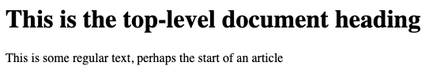

# HTML

## 1. What Is It

**Hyper Text Markup Language** _(HTML)_ is one of the three trinity languages of the web; the other two being Cascading Style Sheets _(CSS)_ and JavaScript. HTML's primary objective is to communicate the hierarchy of, and relationships between, information contained within a document. 

In print publications we are used to interpreting structure based on visual cues given by the publisher. A larger, bold font may indicate a heading. Paragraphs may be broken up with newline spaces. A quotation may be taken out of the flow of the article and put in a pull quote for emphasis. Information may be organized in graphics, lists, or tables. 

In digital publications we want to do all the things we can do in print, but in a way that is readable by both machines and humans. Headings are put within a heading element; lists within a list element; tables within a table element, etc.

Elements are defined by tags and attributes. Most elements have an opening and closing tag, `<tag-name></tag-name>`. Attributes are assigned in the opening tag. Text the user will read is assigned between the opening and closing tag. Let's take a look at an example element.

<hr>

_**Example 1.1**_


>**Code**
>```html
><h1>This is the top-level document heading</h1>
>```

>**Rendered Output**
> 
>

<hr>

The `<h1>` tag creates a heading element that includes the most important organizational text of a document. In print publications, the `<h1>` would be the article title. We can see in the rendered output that the browser is interpreting the text as extremely important; therefore giving it a large font-size and a heavy font-weight.

Now let's add in some regular text using the `<p>` tag, or paragraph tag.

<hr>

_**Example 1.2**_


>**Code**
>```html
><h1>This is the top-level document heading</h1>
><p>This is some regular text, perhaps the start of an article<p>
>```

>**Rendered Output**
>
>

<hr>

The browser is now interpreting the document contents in a logical way. It has taken our `<p>` tag contents and made it a small font-size with regular weighting. 

Let's take this one step further. Let's say this is an article on a page. We can place the `<h1>` and `<p>` tag within an `<article>` tag. The rendered output will be the same as in Example 1.2, but the machine will now know what a sighted user already knows: this text is grouped together, the heading relates to the text below it.

The advantages to a user's browser understanding the conceptual structure are two-fold. First, a user doesn't need to actually see the page to understand it. Screen readers and other assistive technology will know how to present the material to a user appropriately. Second, browsers can make basic assumptions about the intention of the document structure: A `<form>` element can group inputs; a `<button>` can have an action associated with it and be enabled or disabled, a `<video>` element will automatically have an entire suite of browser-built video controls; and the list goes on. 

Now that we understand what HTML is, let's find out how to write it using all the elements that make up a basic document.