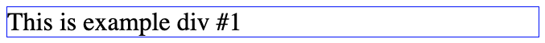

# HTML

**Hyper Text Markup Language** _(HTML)_ is one of the three trinity languages; the other two being Cascading Style Sheets _(CSS)_ and JavaScript. HTML's primary objective is to communicate the hierarchy of, and relationships between, information contained within a document.

HTML is composed of elements created by predefined tags `<tag-name></tag-name>`. Tags are contained within angle-brackets, and further defined through the inclusion of tag attributes. Attributes alter the display or functionality of the element, and help identify it individually and/or as part of a group. As an example, let's look at one of the most commonly used elements:

_**Example 1**_
<hr>

>**Code**
>```html
><div id="example-div-1" class="example-divs" draggable="true" style="border:1px solid blue;">
>    This is example div #1
></div>
>```

>**Rendered Output**
> 
>

The element in _Example 1_ delineates a **div**ision within the content of a document. The element is defined by typing the opening and closing tags, `<div></div>`. Visual content is entered between the tags, `<div>This is example div #1</div>`. 

We have included an `id=""` attribute to give the element a unique way to be identified among other elements in the document, `id="example-div-1"`. No other elements in the document can share the same id. 

Next, we've added a `class=""` attribute which can be used to group elements together either for later manipulation or for styling purposes, `class="example-divs"`.

The `draggable="true"` attribute tells the browser that the element can be dragged around the page; thus altering the functionality of the element.

Lastly, we've included a `style=""` attribute to ask the browser to modify the visual display of the element. In this case, we've specifically defined that the element should have a solid blue border which is 1 pixel(_px_) in width.

We will learn a lot more about tag attributes in the following chapters.

<hr>

The `<div>` is just one element out of over 100 possible HTML elements. Each element type, when used correctly, structures content in a way that is accessible and logical to machines (browsers, etc.) and humans (screens, screen-readers, etc.). For an exhaustive list of HTML elements you can check out the [HTML Elements reference](https://developer.mozilla.org/en-US/docs/Web/HTML/Element) on Mozilla Developer Network (*MDN*). While you're there, bookmark the main MDN page. You'll visit it often.